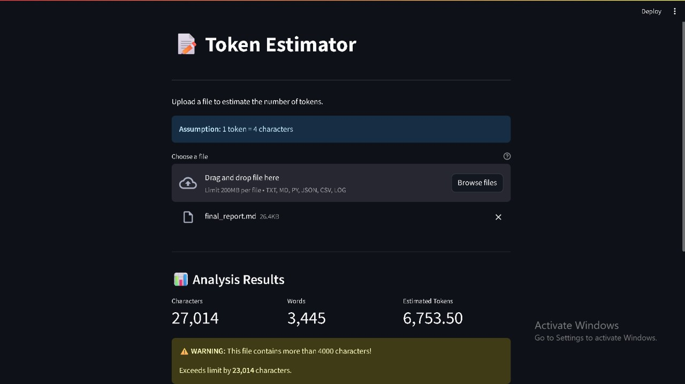

# 📝 Token Estimator

A simple yet powerful tool to estimate the number of tokens in text files. This tool helps you analyze files and estimate token usage based on character count.

## ✨ Features

- **Word Count** - Accurate word counting
- **Character Count** - Total character analysis
- **Token Estimation** - Estimates tokens (1 token = 4 characters)
- **Warning System** - Alerts when files exceed 4000 characters
- **Two Interfaces** - Command-line and beautiful web GUI
- **No External Dependencies** - Simple Python version works standalone

## 📸 Screenshots

### Streamlit Web Interface



## 🚀 Quick Start

### Option 1: Simple Python Version (No Installation Required)

```bash
python token_estimator.py
```

Then enter the path to your file when prompted.

### Option 2: Streamlit Web Interface

1. Install dependencies:

```bash
pip install -r requirements.txt
```

2. Run the app:

```bash
streamlit run token_estimator_streamlit.py
```

3. Open your browser at `http://localhost:8501`

## 📋 Requirements

- Python 3.7+
- For Streamlit version: `streamlit>=1.31.0`

## 💡 Usage Examples

### Command Line Version

```bash
$ python token_estimator.py
Enter the path to your file: sample.txt

==================================================
FILE ANALYSIS RESULTS
==================================================
File: sample.txt
Character Count: 712
Word Count: 98
Estimated Tokens: 178.00
==================================================
```

### Streamlit Version

Simply drag and drop your file into the web interface and see instant results with beautiful visualizations!

## 📊 How It Works

The token estimator uses a simple formula:

```
Tokens = Total Characters / 4
```

This approximation is useful for:

- Estimating API usage costs
- Planning content length
- Monitoring file sizes
- Quick token calculations

## ⚠️ Warning System

Files exceeding 4000 characters will trigger a warning message showing:

- Total character count
- Number of characters over the limit
- Visual alert (in Streamlit version)

## 🗂️ Project Structure

```
Token-Estimator/
├── token_estimator.py           # CLI version
├── token_estimator_streamlit.py # Web GUI version
├── requirements.txt              # Python dependencies
├── sample.txt                    # Sample test file
├── .gitignore                    # Git ignore rules
├── README.md                     # This file
└── screenshots/                  # App screenshots
```

## 🛠️ Development

### Running Tests

Test with the included sample file:

```bash
python token_estimator.py
# Enter: sample.txt
```

### Creating Custom Test Files

Create files with different sizes to test the warning system:

- Small file: < 4000 characters
- Large file: > 4000 characters

## 📝 License

This project is open source and available under the MIT License.

## 🤝 Contributing

Contributions, issues, and feature requests are welcome!

## 👨‍💻 Author

Built with ❤️ using Python and Streamlit

---

**Note**: This tool provides estimates based on a simplified 4-character-per-token ratio. Actual token counts may vary depending on the tokenization method used by different AI models.
